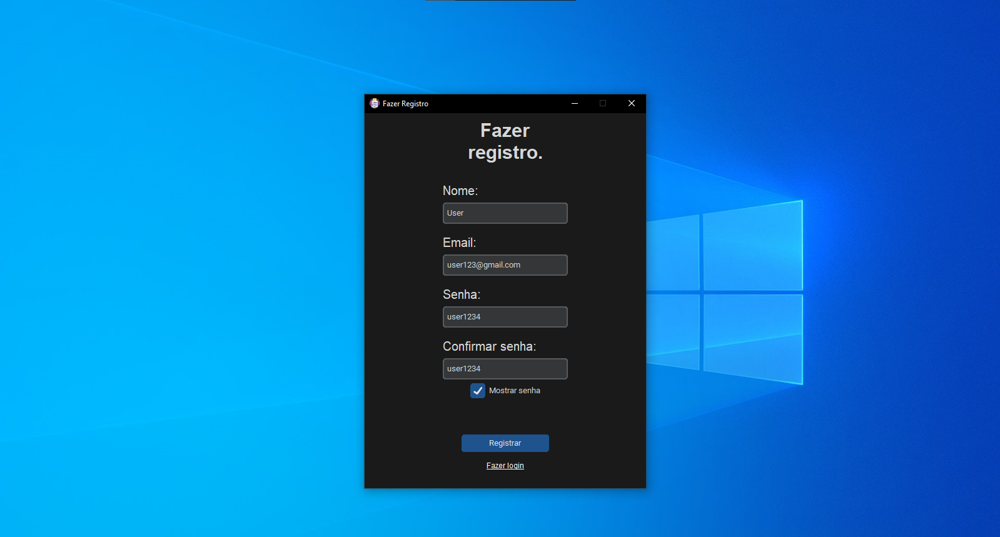
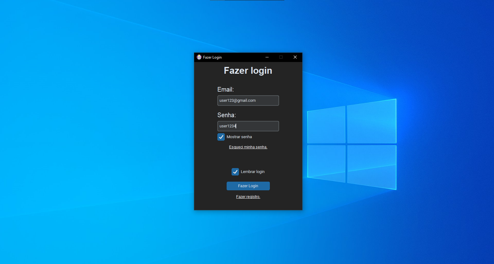
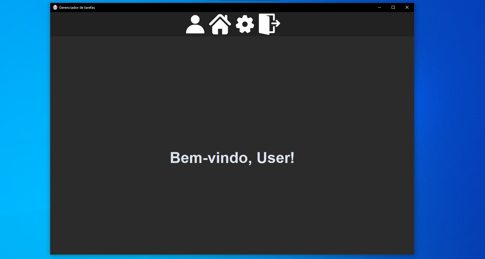
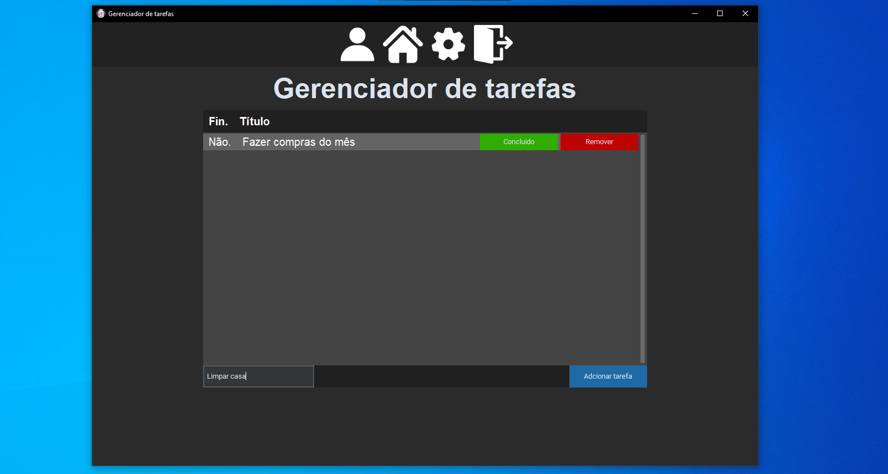

# ✅ Task Manager em Python (CustomTkinter)

Essa é a versão 2.0 do Task Manager. Essa versão apresenta mais funcionalidades para o app, por exemplo
o sistema de login e de registro. Esse sistema de registro salva o usuário que recém foi criado
em um arquivo .json, onde irá conter todos os usuários cadastrados com suas devidas informações.
Obviamente eu deveria salvar os usuário em um banco de dados, como o SQL, mas no momento eu não
sei usar o SQL.
O app também conta com mais funções, dentre elas são: um botão para fazer o logout e ao invés de
abrir uma janela para adcionar uma tarefa, você pode simplesmente adcionar na mesma janela da aba
"home".

OBS: A funcão "Esqueci minha senha" não está funcionando nessa versão! Irei adcionar ela na próxima
versão do app.

## 🧭 Evolução do projeto
- v1.0: Gerenciador de tarefas simples com salvamento em JSON
- v2.0: Sistema de login e contas  com tarefas por usuários

## 📸 Previews





## 🚀 Funcionalidades
- Criar e remover tarefas
- Interface moderna básica
- Sistema orientado a objetos
- Salvamento local dos dados
- Sistema de criar conta

## 🛠️ Tecnologias utilizadas
- Python 3.13
- CustomTkInter

## ▶️ Como executar
1. Clone o repositório:
```bash
git clone https://github.com/EriqueDeSouza-ti/Task_Manager-Python-PT_BR.git