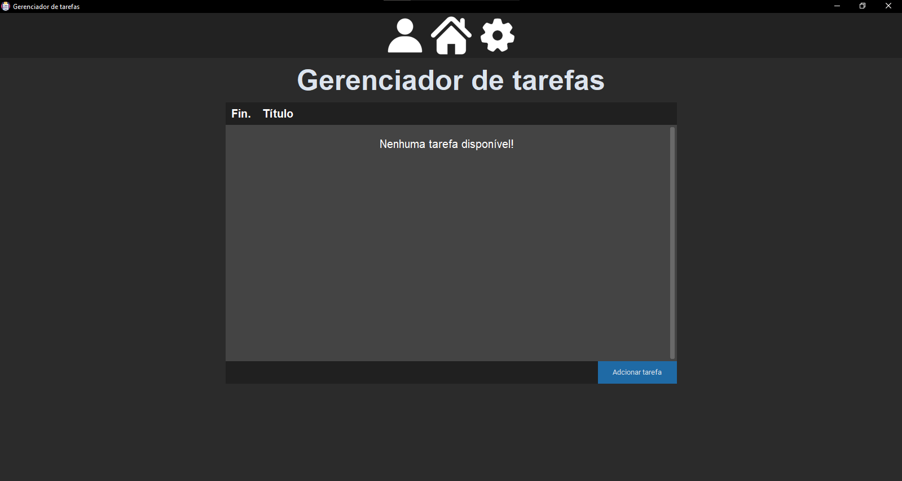

# ✅ Task Manager em Python (CustomTkinter)

Aplicação desktop desenvolvida em Python utilizando CustomTkinter para gerenciamento de tarefas,
com foco em interface moderna e organização de código.

## 📸 Preview


## 🚀 Funcionalidades
- Criar e remover tarefas
- Interface moderna básica
- Sistema orientado a objetos
- Salvamento local dos dados

## 🛠️ Tecnologias utilizadas
- Python 3.13
- CustomTkInter

## ▶️ Como executar
1. Clone o repositório:
```bash
git clone https://github.com/EriqueDeSouza-ti/Task_Manager-Python-PT_BR.git